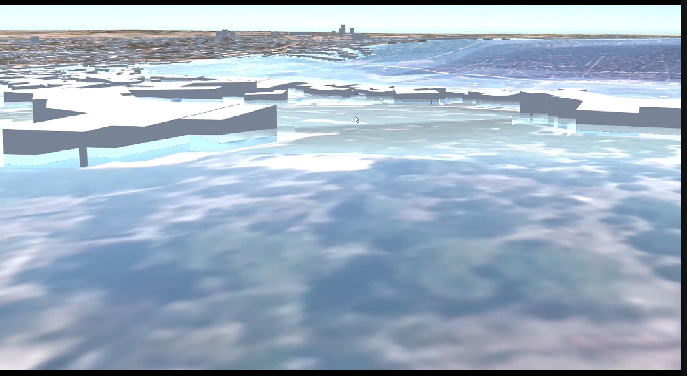
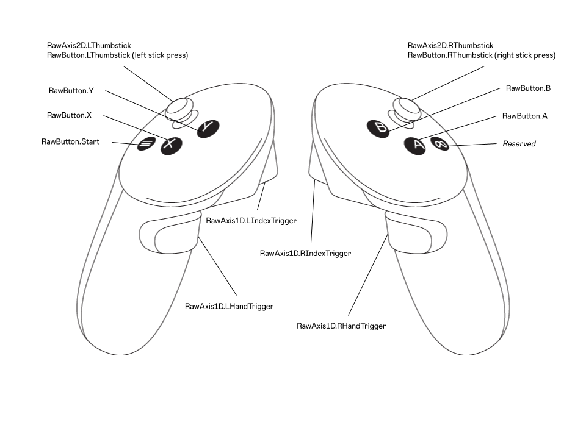

# 🌍 Immersive 3D Flood Data Visualization in Unity for Meta Quest

This Unity project delivers a highly immersive 3D visualization of real-world flood data, designed specifically for **VR on Meta Quest 3**. Built using [Cesium for Unity](https://cesium.com/learn/unity/), it renders high-fidelity, globe-scale terrain and cityscapes—including [Photorealisitic 3D Tiles](https://developers.google.com/maps/documentation/tile/3d-tiles) from Google Earth and [OpenStreetMap building](https://www.openstreetmap.org/#map=13/51.94691/6.97400)—to recreate flooded environments with geospatial accuracy.

Users can **walk, fly, and explore in full virtual reality**, experiencing flood impacts from a street-level or aerial perspective. The integration of **Cesium’s double-precision geospatial engine** with Unity’s XR platform ensures both global-scale navigation and local immersion are fluid and precise.

---

## 🎬 Demo Video

---

## 📌 Getting Started

Before diving into the project, complete the following setup steps to configure your environment:

### 1. Cesium for Unity Setup

👉 Follow the official **Cesium for Unity Quickstart** guide:  
[Cesium for Unity Quickstart](https://cesium.com/learn/unity/unity-quickstart/)

This will walk you through:

- Importing the Cesium for Unity packages
- Creating or logging into a [Cesium ion](https://cesium.com/ion/) account
- Generating an Access Token
- Adding the Access Token to your Unity Project

### 2. XR Setup for Meta Quest (Unity OpenXR)

👉 Follow the official **Meta XR Unity Project Setup** documentation:  
[Set up Unity for XR development](https://developers.meta.com/horizon/documentation/unity/unity-project-setup)

This guide covers project configuration for Meta Quest support, including:

- Enabling XR Plugin Management in Project Settings
- Setting up **Unity's OpenXR Plugin** for Meta Quest (do **not** use the Oculus XR Plugin)
- Configuring Android build settings (e.g., target SDK, permissions)
- Enabling hand/controller input profiles for Quest

---

## 🗺 Project Overview

### Main Features

- **Global-Scale Geospatial Visualization**: Uses **Cesium World Terrain**, **OSM Buildings**, and optionally **Photogrammetric 3D Tiles** (via Google Earth, if available) for highly realistic terrain and urban structure rendering.
- **Flood Data Rendering**: Visualizes flood depth data from `.tif` files processed into binary format.
- **Immersive XR Navigation**: Supports walking and flying through the scene with Meta Quest controllers.
- **Flood Interaction**: Simple toggle to show/hide water; extensible for more complex interactivity.

---

## 🌊 Flood Data Pipeline

Flood data starts with a `.tif` file (e.g., `flood_data.tif`) and is converted into binary format using a simple python script. For more information on reading the `.tif` files, processing and saving the resulting `.bin` 
files compatible with this application, refer to this [github repo](https://github.com/VemburajYadav/TIFF-Data-Processing).

### Output Files (per flood dataset):

- `wgs84_matrix.bin`: Latitude & longitude grid (EPSG:4326)
- `ecef_matrix.bin`: Earth-Centered, Earth-Fixed coordinates (ECEF)
- `src_crs_matrix.bin`: Original Coordinates in the TIF's source Coordiante Reference System
- `water_depth_matrix.bin`: Water depth grid
- `invalid_mask.bin`: Binary mask indicating invalid or missing grid points

> 📁 Place the resulting folder (e.g., `flood_data/`) inside `Assets/StreamingAssets/`.

---

## 🔍 Flood Visualization Details

Flood data visualization is managed through the `FloodVisualizer.cs` script, which dynamically generates and renders a water mesh based on geospatial data processed from a `.tif` file.

### 🔧 Visualization Pipeline

1. **Data Grid Size**: The flood data is sampled on a **H×W grid**, where each point corresponds to a geospatial location (typically several meters apart), covering an area of several kilometers.

2. **Terrain Height Sampling**:
   - For each grid point, the **terrain height is obtained by querying the Cesium World Terrain tileset** using Cesium for Unity's API ([SampleHeightMostDetailed](https://cesium.com/learn/cesium-unity/ref-doc/classCesiumForUnity_1_1Cesium3DTileset.html#a06f95d6556fbcd626d57901941c5602f)).
   - This ensures that the flood water surface is accurately positioned relative to the underlying digital terrain model.
   - The water depth at each point is then **added to the terrain height** to compute the final world-space elevation of the water surface.

3. **Mesh Partitioning**:
   - To maintain rendering precision and performance in Unity (which uses single-precision floats), the flood grid is divided into **16×16 submeshes**.
   - Each submesh represents a manageable section of the flood area, enabling efficient culling and accurate local positioning.

4. **Anchoring in World Space**:
   - Each submesh is anchored with a `CesiumGlobeAnchor` component.
   - This lets the submesh exist at its correct global geospatial location using **double-precision coordinates** from Cesium, while keeping the mesh vertices local to the anchor (which Unity requires to be single-precision).

5. **Vertex Generation**:
   - Vertex positions are calculated relative to the submesh anchor.
   - Heights are offset by flood depth on top of the queried terrain elevation.
   - An **invalid mask** is applied to exclude undefined or missing data points from visualization.

6. **Custom Water Shader**:
   - A **ShaderGraph-based material** dynamically controls the RGB color and alpha of each vertex based on flood depth.
   - This allows for visual representation of depth severity through color blending and transparency.

### 🧪 Design Considerations

- **Floating Point Precision**: Partitioning into submeshes and using anchor-relative coordinates avoids instability from large global positions in Unity.
- **Terrain Accuracy**: Cesium World Terrain queries ensure the water sits precisely above the real-world ground level.
- **Performance**: The architecture scales efficiently with mesh tiling and supports GPU culling optimizations.

> ✅ Accurate terrain sampling + flood depth ensures visual fidelity with real topography.  
> 🔧 **TODO**: Introduce smooth color gradients based on water depth, and add optional wave/animation effects.

---

## 🕹 XR Navigation and Interaction

Navigation and interaction in the immersive environment are handled through the `SceneNavigator.cs` and `FloodInteraction.cs` scripts. These provide intuitive, controller-based movement and interactive tools tailored for **Meta Quest 3** using **Unity's OpenXR Plugin**.

### 🎮 Locomotion Mechanics (`SceneNavigator.cs`)

The system provides full 6-DOF (degrees of freedom) movement in large-scale, globally anchored environments:

- **Right Thumbstick**: 
  - Moves the user along the horizontal plane defined by the headset’s orientation.
  - Combines forward/back and strafe left/right movement using the camera's directional vectors.

- **Left Thumbstick**:
  - Moves the user vertically up/down.
  - Enables aerial exploration (flying) or elevated observation modes.

- **Index Triggers (Left & Right)**:
  - Movement speed scales with the degree to which the trigger is pressed (analog input).
  - Allows slow walking for close inspection or fast flying across regions.

- **Hand Triggers (Left & Right)**:
  - Rotates the entire `TrackingSpace` (the GameObject under which the player is anchored) left or right.
  - This acts as smooth snap-turn functionality for broader directional control.

### 🎛 Interaction Features (`FloodInteraction.cs`)

Initial interaction capability includes:

- **Right A Button**:  
  - Toggles the visibility of the flood mesh in the scene.
  - Allows quick switching between flooded and non-flooded views for comparison or impact assessment.

> This forms the basis for further interactive features, such as:
> - **Data probing tools** to inspect flood depth at specific locations.
> - **Spatial queries** (e.g., selecting high-risk areas).
> - **Temporal controls** to step through time-varying flood scenarios.

### 🎮 Controls Overview

| **Input**                 | **Action**                                         |
|--------------------------|----------------------------------------------------|
| Right Thumbstick         | Move in camera's forward/right direction           |
| Left Thumbstick          | Move up/down                                       |
| Left/Right Index Trigger | Control movement speed (analog, pressure-based)    |
| Left/Right Hand Trigger  | Rotate view left/right                             |
| Right 'A' Button         | Toggle flood visibility (show/hide water mesh)     |

---

## 🔮 Planned Features / TODO

- [ ] Improve ShaderGraph visualization using colormap gradients
- [ ] Timeline slider for visualizing flooding over time
- [ ] Region-based highlighting and selection
- [ ] Add interactive pointer-based tools (e.g., depth probe, info overlays)
